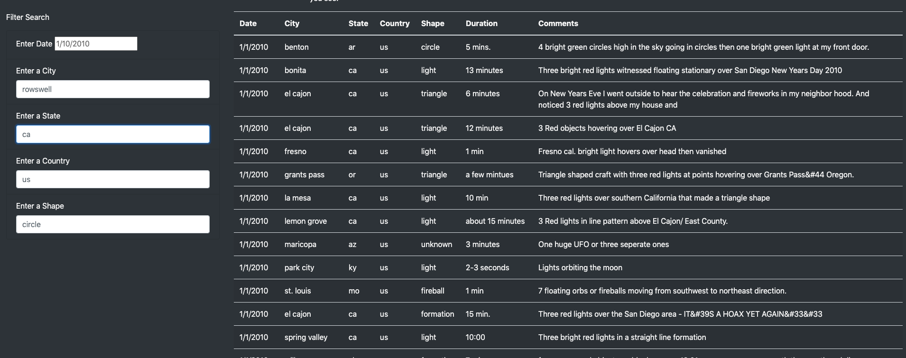
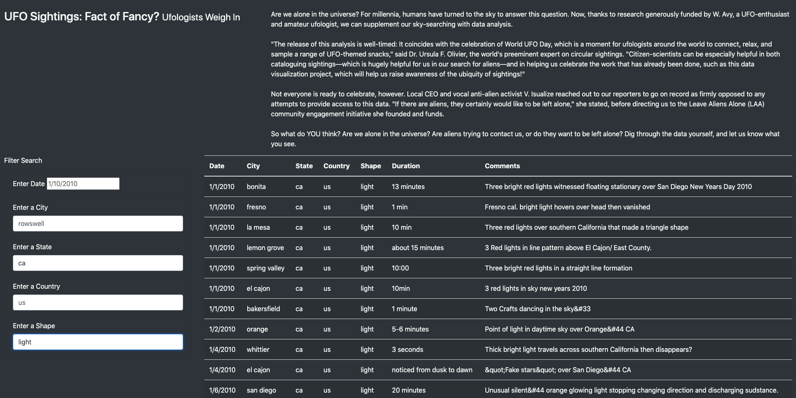
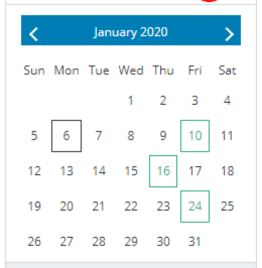

# UFOs

## Overview of Project: 
The purpose of this project is to take UFO data stored in a JS file and use that to create an interactive webpage. This webpage allows the user to search for UFO sightings throughout the US based on different criteria. 

## Results: 
The first step of this project was to create a webpage that could be searchable by 1 critieria, date. From there I built a working interactive webpage, but theere was more information that could be used to filter through the UFO sightings. The webpage was expanded to search by city, state, country or shape in addition to the date. This makes reading this table of UFO sightings much easier for users. Users may be interested in different criteria to search for recorded UFO sightings, such as city. If someone is curious if their city has any recorded UFO sightings, rather than searching by date, they can now easily do so. Once on the webpage, all a user has to do is fill in the information they are intersted in searching by, whether thats one or all 5 filters provided. Clicking "return" or "enter" after they type in their filter information, then gives them a table of UFO sightings specific to the criteria they are interested in. 

### UFOs Webpage

### Example with a filter - ca sightings with a shape of a light 

## Summary: 
One drawback of this design is removing the filter button. The filter button makes it extremely clear how to run the filter - by clicking the button. By removing the button, we are assuming people will understand that they must press "return" or "enter" on their keyboard to run the filter. Additionally, our entire data file is not very large. It appears to only have sightings from the month of January in the year 2020. It only has US data, and does not include every city in the US. It is also not clear from the webpage what are the different shapes a UFO sighting can be. I think especially for the field "shape" this should be a drop down menu, since the general public may not know all the options for UFO shape. If there are limited options for the other fields as well, a drop down option for Country, State & City could be useful as well. They would help users understand that this data only includes a small number of country, states and cities. Similarly to the Country, State & City filter, the date filter can be presented differently as well to help users navigate the limited data available. Since there appears to only be data for January 2020, a filter option that has a calendar pop up with only the dates included in this dataset selectable will keep upsers from trying to filter by dates that aren't present in this dataset. 

### Date Filter - Calendar Select Option 

Since we have limited dates to select from, giving users a drop down menu like this will make it very clear what dates we have data for. A calendar with only available dates selectable (and non-existent dates greyed out). Currently, its not apparent to users that we only have Jan 2020 data to select from. Users could waste time searching for other dates before realizing we have limited data available to select from. 
